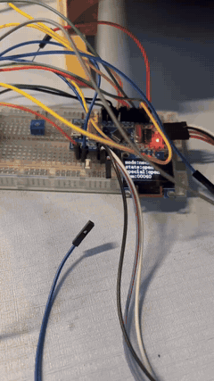
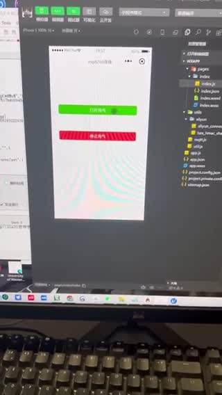
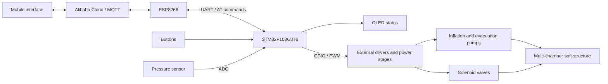
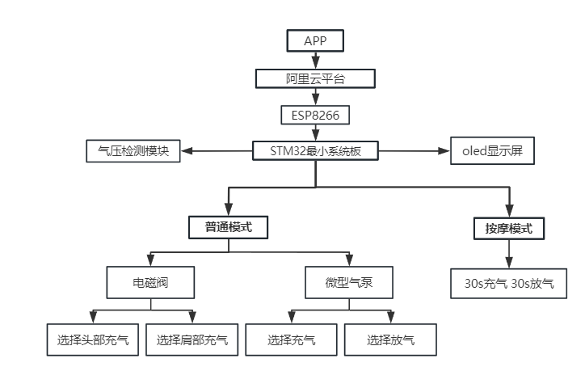
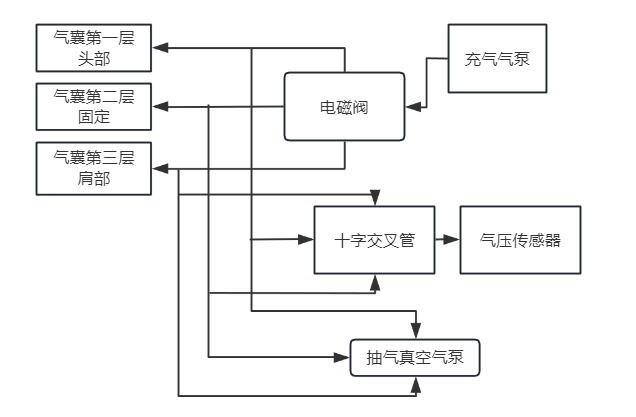
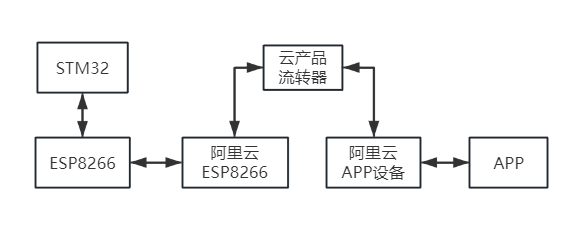
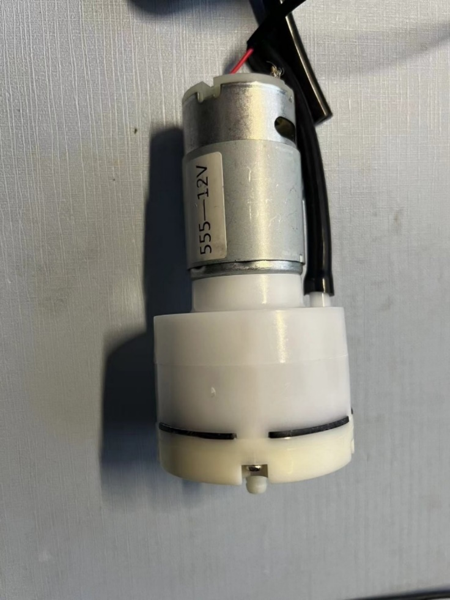
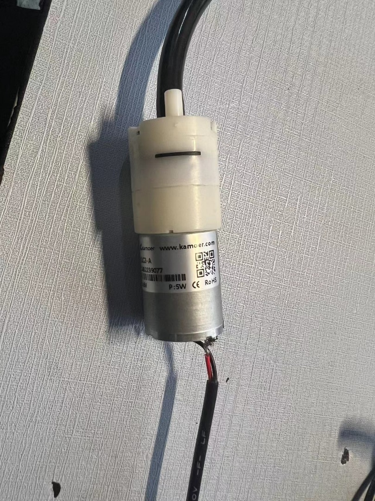
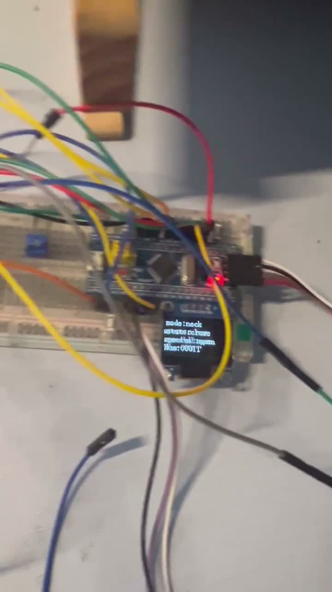

# Pneumatic Soft Robot

**STM32 pump and valve control for a multi-chamber neck-support prototype**

[中文说明](README.zh-CN.md) · [Demo videos](#demo-videos) · [Firmware](9-4%20串口收发文本数据包/User/main.c)

My 2024 undergraduate capstone at **Shenzhen University**. This project brings together an inflatable soft structure, an STM32 controller, pumps and solenoid valves, pressure sensing, and a mobile control interface.

`C` `STM32F103C8T6` `PWM` `ADC` `UART` `ESP8266` `MQTT` `OLED`

<table>
  <tr>
    <td align="center"></td>
    <td align="center"></td>
  </tr>
  <tr>
    <td align="center"><b>Working prototype</b> Full-length preview of the original demonstration</td>
    <td align="center"><b>App control</b> Click the image to open the original video</td>
  </tr>
</table>

## What the project does

- **Pneumatic actuation:** controls inflation and evacuation pumps and solenoid valves connected to a three-layer inflatable structure.
- **Local interaction:** physical buttons select modes and operating states; an OLED displays controller status.
- **Embedded control:** GPIO and timer PWM drive the external power stages, while timer interrupts support cyclic operation and ADC reads the pressure-sensor signal.
- **Remote interaction:** the graduation project documents a mobile interface connected through Alibaba Cloud and an ESP8266 UART/AT-command link.

The project explores a neck-support and massage application as an **academic prototype**. The material presented here demonstrates engineering functions, not clinical outcomes.

## Demo videos

These four MP4 files were extracted directly from slides 12–13 of my graduation presentation. The original video and audio tracks are preserved. Click a title to open a video; download it if your browser does not offer playback.

| Demonstration | Duration | What to look for |
|---|---:|---|
| [Pneumatic prototype](docs/assets/pneumatic-demo.mp4) | 24 s | Soft structure, tubing, controller and physical operation |
| [System walkthrough](docs/assets/system-demo.mp4) | 25 s | Pumps, bench wiring and OLED status |
| [App control](docs/assets/app-control-demo.mp4) | 11 s | Control interface and connected pump |
| [Bench demonstration](docs/assets/bench-demo.mp4) | 23 s | Inflatable structure and controller setup |

## System design

The original design connects the application and cloud platform to the STM32 through an ESP8266. The STM32 handles local controls, sensor acquisition, the display, and pump/valve outputs.

Original diagrams from the graduation presentation

**Overall design**

**Pneumatic connections**

**Wireless control path**

## Hardware

| Component | Role |
|---|---|
| STM32F103C8T6 development board | Main controller running C firmware with the STM32 Standard Peripheral Library |
| Inflation pump and vacuum pump | Inflate and evacuate the soft chambers |
| Solenoid valves | Select the pneumatic path |
| Motor-driver and power-conversion modules | Interface MCU control signals with the pump and valve loads |
| RSCM17100KP020 pressure-sensor module | Analog pressure signal acquisition |
| ESP8266 Wi-Fi module | UART/AT-command connection to the cloud platform |
| OLED and push buttons | Local status display and user input |

<table>
  <tr>
    <td align="center"></td>
    <td align="center"></td>
    <td align="center"></td>
  </tr>
  <tr>
    <td align="center">Inflation pump</td>
    <td align="center">Vacuum pump</td>
    <td align="center">Controller and OLED</td>
  </tr>
</table>

## Engineering work

The capstone covers embedded firmware, component integration, and bench testing. The graduation records describe work on:

- Configuring STM32 peripherals and organizing button, display, sensor and actuator functions around a main loop and interrupts.
- Integrating external drivers and power supplies for the pump and valve loads, including revising the vacuum-pump power arrangement during testing.
- Connecting the mobile interface, cloud message routing and ESP8266 link; resolving a message-format mismatch during cloud communication tests.
- Testing local mode switching, pneumatic operation and the remote control interface, documented in the original demonstration videos.

## Firmware navigation

The original Keil project is preserved in [`9-4 串口收发文本数据包`](9-4%20串口收发文本数据包). Its existing folder name and firmware files are unchanged.

| File | Responsibility |
|---|---|
| [`User/main.c`](9-4%20串口收发文本数据包/User/main.c) | Initialization, mode/state logic and command handling |
| [`Hardware/Motor.c`](9-4%20串口收发文本数据包/Hardware/Motor.c) | Pump/valve driver interfaces |
| [`Hardware/PWM.c`](9-4%20串口收发文本数据包/Hardware/PWM.c) | Timer PWM configuration |
| [`Hardware/Serial.c`](9-4%20串口收发文本数据包/Hardware/Serial.c) | USART and text-packet reception |
| [`Hardware/AD.c`](9-4%20串口收发文本数据包/Hardware/AD.c) | Analog input acquisition |
| [`Hardware/Key.c`](9-4%20串口收发文本数据包/Hardware/Key.c), [`Hardware/OLED.c`](9-4%20串口收发文本数据包/Hardware/OLED.c) | Local input and display |
| [`System/Timer.c`](9-4%20串口收发文本数据包/System/Timer.c) | Periodic timer configuration |

Open [`Project.uvprojx`](9-4%20串口收发文本数据包/Project.uvprojx) in Keil µVision to inspect the project. Its configured target is STM32F103C8 and it uses the Standard Peripheral Library. Hardware operation depends on the original wiring and external driver modules.

## Archive scope

This repository preserves the final firmware snapshot supplied for the project. The photos, diagrams and videos come from the 2024 graduation materials. Those materials document cloud connectivity and pressure-threshold experiments; related initialization and threshold statements are commented out in the archived `main.c`. The demonstrations provide historical project context and do not imply that every documented feature is enabled in this source configuration. The pressure experiments are not presented as calibrated closed-loop pressure control.

**Author:** Wanju Luo · Shenzhen University, 2024 
**Original project:** 面向颈脖理疗的智能软体机器人的设计与实现 
**Portfolio:** [wanju-luo.pages.dev](https://wanju-luo.pages.dev)
